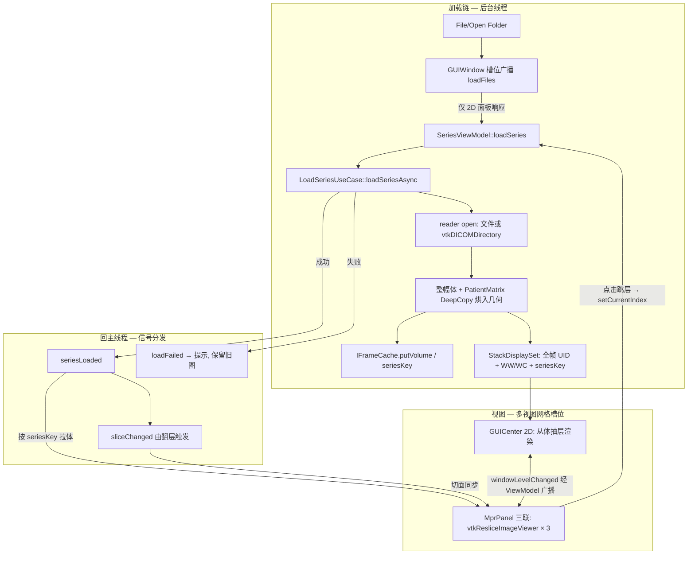
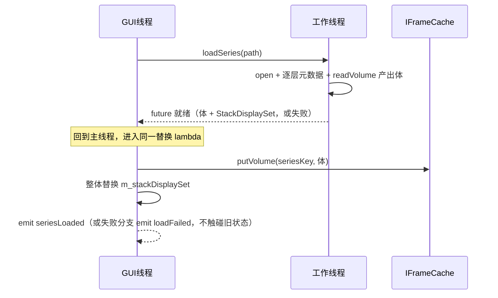

## Goal Capsule

- **目标：** 用户打开一个 DICOM 序列（单文件或目录）后，可在 2D 视图逐层浏览，并在多视图网格中同时看到与 2D 共享窗宽窗位和层位置的三平面 MPR 视图；无效输入不崩溃、有可见提示。
- **手段：** 整幅体数据作为唯一像素源，经 IFrameCache 体槽位按 SeriesInstanceUID 共享（KTD1、KTD2）；MPR 以独立渲染器 + IViewPanel 注册进现有网格（KTD3）；序列一次全读入（KTD4）。
- **权威层级：** 本计划的产品行为以 Product Contract 为准；实现机制以 Planning Contract 的 KTD 为准；单元实现不得偏离其引用的 R/KTD。
- **停止条件：** 全部 R 满足、Verification Contract 全绿、Definition of Done 全项成立。
- **执行画像：** `execution: code`，6 个实施单元，按 U1 → U6 依赖顺序执行；读取层先以测试锁定约定（各单元 Execution note 标注）。

---

## Product Contract

### Summary

本计划把现有"只读第 0 帧"的加载链升级为完整序列读取：目录作为序列打开、整幅 3D 体入缓存、2D 支持逐层导航，并新增一个注册进多视图网格的三平面 MPR 面板，与 2D 共享同一份体数据并双向联动窗宽窗位与层位置。

### Problem Frame

当前实现存在四个缺口。其一，`GUIWindow::openFolder` 把目录字符串直接交给只支持单文件的 reader，打开文件夹必然失败。其二，`LoadSeriesUseCase` 只调用 `readFrame(0)`，`StackDisplaySet` 只有一帧，序列的其余层永远不可达，翻层能力缺失。其三，MPR 是多视图框架（见 `docs/plans/2026-09-13-1533-refactor-multi-view-framework-plan.md`）明确预留的后续计划，但没有数据通道与渲染器让第二个面板显示内容。其四，加载失败时异常在裸 `std::thread` 中重抛，整个应用直接崩溃——对医疗影像查看器不可接受。

### Requirements

**序列读取：**

- R1. File > Open 接受单个 DICOM 文件，File > Open Folder 把目录作为序列打开；两者产出一致的序列显示。
- R2. 一次序列读取得到整幅 3D 体、总层数与 SeriesInstanceUID；体数据是本次显示的唯一像素源，2D 与 MPR 共享它。
- R3. StackDisplaySet 的帧列表包含序列内全部 SOP Instance UID；第 0 帧的窗宽窗位作为初始显示设置。

**2D 导航：**

- R4. 2D 视图支持滚轮与侧边滑条逐层导航；层索引夹取在有效范围；翻层不重置相机与窗宽窗位；显示当前层/总层数。

**MPR 显示：**

- R5. MprPanel 作为单个 IViewPanel 注册进网格占一个槽位，内部并排显示轴/冠/矢三个平面；用户切到 1x2/2x2 布局后可见。
- R6. 序列加载完成后，MPR 面板在可见时即显示三平面，无需自行触发加载；"先打开序列、后切布局"与"先切布局、后打开"两种顺序结果一致。

**联动：**

- R7. 窗宽窗位在 2D 与 MPR 之间双向联动；菜单、2D 交互、MPR 交互任一处的修改在两处一致，以最后操作为准。
- R8. 层位置双向联动：2D 翻层时 MPR 切面同步到对应解剖位置；点击 MPR 平面时 2D 跳到对应层；坐标越界夹取到 [0, N-1]。

**失败处理：**

- R9. 打开无效文件、空目录或非 DICOM 内容时应用不崩溃；向用户显示失败提示；已显示的图像保留。

### Success Criteria

- 打开多层序列目录 → 2D 翻层正常 → 切 1x2 布局后 MPR 三平面显示，且翻层、窗宽窗位在两视图间同步。
- `ctest` 全绿，含新增的读取层、缓存、用例、联动测试；lint/format/spell 门禁通过。
- 打开 `res/` 下任意无效/非 DICOM 路径，应用存活并给出提示。

### Scope Boundaries

**范围外（本计划不实现）：**

- 体绘制（3D VR）、任意角度 reformat、测量/标注工具。
- DCMTK / GDCM / HybridReader 的目录与序列支持（继续只用 VTK reader）。
- 多 stack 序列（localizer/scout）的 stack 选择 UI——默认取层数最多的 stack。
- 点击格子切换焦点（`setFocusedSlot` 仍无调用者）、resize 相机行为调整。

**Deferred to Follow-Up Work：**

- `readSeries()` 补实与领域 Series 树的消费（当前无调用方，不进本计划的 R 追溯）。
- 加载串行化的代次化改造（消除大序列 join 卡顿；见 System-Wide Impact 的屏障约束）。
- gantry-tilt 序列的 `vtkDICOMCTRectifier` 矫正。
- MONOCHROME1 反转 LUT、DICOM 精确 WW−1/WC−0.5 校准。
- 遗留 `Frame` 路径（slope/intercept 手动转换）与体路径的归并清理。
- 加载序列后旧 SeriesInstanceUID 体数据的 LRU 淘汰（当前为单槽替换）。

---

## Planning Contract

### Key Technical Decisions

- KTD1. 体数据为唯一像素源，2D/MPR 切片渲染时从体按需抽取 (session-settled: user-approved — chosen over 逐层全缓存: 避免体与逐层副本双份内存)。
- KTD2. 在 IFrameCache 上扩展 putVolume/getVolume 体槽位，键为 SeriesInstanceUID (session-settled: user-approved — chosen over 新建独立 IVolumeCache: 复用现有抽象类与实现模式)。
- KTD3. 新增独立 IMprRenderer，MprPanel 经 IViewPanel 注册进网格 (session-settled: user-approved — chosen over 扩展 IImageRenderer: 两视图渲染职责不同，且 2D 渲染接口保持不动)。
- KTD4. 序列一次全读入缓存，不做逐层懒加载 (session-settled: user-approved — chosen over 懒加载: vtk-dicom 一次 Update 已把整幅体载入内存，懒加载无收益)。
- KTD5. 目录打开经 vtkDICOMDirectory 枚举 → SetFileNames 喂给 reader；reader 用 SetMemoryRowOrderToFileNative；逐层元数据经 GetFileIndexArray/GetFrameIndexArray 索引取（切片索引 ≠ 文件索引，禁止硬编码实例 0）。依据：vtk-dicom 0.8.17 无 SetDirectoryName，排序由 reader 按 IPP/IOP 自动完成（外部研究）。
- KTD6. 采纳体数据时 DeepCopy `GetPatientMatrix()`，把旋转部分烘入体的方向矩阵、平移部分烘入原点；此后体即患者空间，2D 抽层与 MPR reslice 消费同一几何，朝向天然一致。依据：reader 输出 origin 恒为 (0,0,0)、方向为单位阵，患者几何只在 reader 持有的矩阵里（外部研究）；矩阵由 reader 持有，不 DeepCopy 会在下次加载时悬空。
- KTD7. ViewModel 信号拆分为 `seriesLoaded(seriesUid)`（加载完成）、`sliceChanged(index)`（翻层）、`loadFailed(path, reason)`（失败）；跨线程信号参数统一用 QString（对齐既有 `viewRegistered(const QString&)`，避免 std::string 跨线程连接静默失败断掉失败通道）。MprPanel 只订阅 seriesLoaded、经 ViewModel 暴露的取体入口按 seriesKey 取体（view 不直读 IFrameCache），其 `loadFiles` 保持 no-op——否则 `openFile` 的槽位广播会造成同一路径双加载。seriesLoaded 后 ViewModel 立即广播一次 windowLevelChanged，作为 MPR 初始窗宽窗位通道。
- KTD8. 渲染目标按面板隔离：IMprRenderer 由 main.cpp 组合根构造并注入 MprPanel（面板不自建具体实现，与既有注入惯例一致），MprPanel 持自己的三个 render window；reader/taskQueue/cache 仍在 ServiceContainer 共享。`refreshLayout()` 对新变为可见或上下文重建的面板补调 `activate()`，与 show/上下文重建事件绑定且幂等（现状 activate 只在注册时对第一个面板调用一次）。
- KTD9. 并发模型：加载期间 GUI 继续用旧 StackDisplaySet/旧体；体与显示集必须在回主线程的同一替换点提交——`putVolume` 在整体替换 lambda 内执行，后台任务只产出体与元数据（"先 put 后发信号"会产生加载中途 2D 按旧 seriesKey 拉体 miss 的空白）；MemoryFrameCache 增加互斥锁保护体槽位与帧读写，`get` 在锁内返回 `shared_ptr` 拷贝而非内部引用（现状无锁，后台 put 与 GUI 线程 get 存在数据竞争）。
- KTD10. 滚轮=翻层（在 Qt/VTK 事件链中抢先处理），缩放保留给拖拽与 fit；侧边滑条 + "n/N" 层号为保底导航。依据：默认 vtkInteractorStyleImage 的滚轮是相机推进、不翻层（外部研究）。
- KTD11. 窗宽窗位联动经 ViewModel 广播：renderer 暴露 windowLevelChanged 回调（观察 vtkCommand::WindowLevelEvent），回调统一由 ViewModel 持有，面板不直接挂 renderer 回调；ViewModel `setWindowLevel` 与交互修改统一广播给所有面板，最后操作为准；菜单仍经 focusedPanel() 进入。程序化回写期间须抑制回调并做值比较幂等，防止广播-回灌成环。
- KTD12. 单 MprPanel 内部为三联子视口（轴/冠/矢并排），三平面共享一个 vtkResliceCursor 做十字线与切面同步，采用 VTK FourPaneViewer 范式（每子视口一个 QVTKOpenGLNativeWidget + vtkResliceImageViewer）（外部研究）。
  - 修订（2026-09-29）：渲染基座改为每平面一条 `vtkImageSlice` + `vtkImageResliceMapper`（显式方向矩阵感知的 `vtkPlane` 切面），不再使用 vtkResliceImageViewer/vtkResliceCursor。原因：轴对齐模式下 cursor widget 本就被禁用（无可见十字线、无跨平面切面联动，KTD12 的意图未成为可见行为），reslice viewer 是不必要的重壳。KTD10（滚轮翻层）语义由 `vtkInteractorStyleImage` 子类覆写滚轮实现，KTD11/R7/R8 联动语义不变；CMake 依赖由 `InteractionImage`/`InteractionWidgets` 改为 `RenderingImage`。

### High-Level Technical Design

加载与提交的时序（KTD9 的"同一替换点"约束）：

数据流要点：体只存一份（KTD1），加载完成信号带 seriesKey（KTD7），MPR 按键拉取而非被广播加载；两个面板的反向交互（点击、拖窗宽窗位）都收敛回 ViewModel 再广播，避免面板间直接耦合。

### System-Wide Impact

- 接口编译面：`IDicomReader` 的三个新方法在基类提供默认实现（返回空/抛出），范围外的 DcmtkReader/GdcmReader/HybridReader 不改动即可编译；后续接入各自补实现。
- 构建依赖：`vtkResliceImageViewer`/`vtkResliceCursor` 属 VTK InteractionImage 等模块，不在根 `CMakeLists.txt` 现有 `find_package COMPONENTS` 与 autoinit 中，须随 U5 注册。
- 信号契约：跨线程信号参数用 QString（见 KTD7）；renderer→ViewModel 回调由 ViewModel 统一持有（见 KTD11）。
- 状态生命周期：体与显示集在同一主线程替换点提交（见 KTD9）。
- 加载串行化：`loadSeries` 的 join 串行化同时是 reader 单例免于全局线程池并发的唯一屏障，不可直接移除；若为消除大序列卡顿改为用例内排队，必须带代次判定防旧结果覆盖新结果（列入 Deferred）。
- 面板/GL 生命周期：布局切换会重挂全部 widget 触发 GL 上下文重建（2D + MPR 三联共 4 窗），重建后须主动重 Render（见 KTD8、Risks）。
- 打开广播盲区：`openFile/openFolder` 现只遍历活动槽位——Single 布局下把 MPR 指派到槽 0 时 2D 收不到 loadFiles。改为遍历全部已注册面板，MPR 的 no-op 使此举安全（U5 落地）。

### Risks & Dependencies

- 内存峰值：序列 swap 期为旧体 + 新体 + reader 内部缓冲，约 2× 单序列体积。缓解：reader 输出与缓存共享同一 `vtkImageData`（浅共享不复制），swap 后面板立即换引用释放旧体，reader 打开新序列前 close 旧体；2D 抽层的临时对象不入缓存。
- 并发残余风险：ci-sanitize 仅 ASan+UBSan、无 TSan，压力用例证伪不了数据竞争。缓解：`get` 在锁内返回 `shared_ptr` 拷贝（KTD9）；"锁覆盖全部 get/put 路径"列为评审检查项。锁解决不了 put-before-swap 的时序问题，该问题由 KTD9 的同点提交解决。
- 外部行为假设：vtk-dicom 0.8.17 已由 vcpkg override 钉版；排序/UID/几何的运行时行为由 U1 测试断言。缓解：声明承诺范围为经典单帧 CT/MR 序列，enhanced 多帧与无 PatientMatrix 的文件不在承诺内（走占位兜底）。
- 显示基线变化：KTD6 烘入患者几何后，相机 reset、朝向与左右镜像的既有基线全部改变。缓解：手动冒烟比对同一文件改动前后显示一致（不镜像），必要时用 `ImageDataComparator` 做像素级对比。
- GL 多窗口：布局切换的上下文重建可能黑窗。缓解：show/重建后主动重 Render；确认 `setRenderTarget` 幂等（现有实现只 AddRenderer 不摘旧窗）；interactor 初始化顺序按 FourPaneViewer 范式锁定。
- 联动反馈环：广播-回灌成环风险。缓解：程序化更新期间抑制回调 + 值比较幂等（KTD11、U6）。
- 测试夹具可维护性：夹具生成脚本入库 `tools/`，测试中断言夹具层数完整性，保证夹具可再生。

### Sequencing

U1（读取 API + 夹具）→ U2（体槽位）→ U3（用例 + 失败通道）→ U4（2D 导航）→ U5（MPR 面板）→ U6（联动）。U1 与 U2 可并行；U3 依赖两者；U5 依赖 U3；U6 依赖 U4 与 U5 全部完成。夹具制作可作为前置步骤与 U1 的 API/TDD 工作并行。

### Sources & Research

- vtk-dicom 0.8.17 行为（目录枚举、排序、索引数组、PatientMatrix、AutoRescale 已输出 HU）核对自 vcpkg 源码树 `vtk-dicom v0.8.17` 的 `Documents/ImageReader.md`、`Documents/Directories.md` 与 `Source/vtkDICOMReader.h`。
- MPR 范式取自 VTK 9.3 源码树 `Examples/GUI/Qt/FourPaneViewer/QtVTKRenderWindows.cxx`；`vtkResliceImageViewer` 自带滚轮翻层回调；`vtkImageReslice` 输出维为 1 时性能劣化，三平面统一走 reslice。
- 仓库模式研究结论：`gen_src.py` 配置期重生成 `source_list.cmake`；测试需在 `test/CMakeLists.txt` 手动接线；信号接线范式为面板构造函数内 connect（`GUICenter.cpp`）；`res/` 无多层序列夹具。
- 流程序分析：失败路径现为 `std::terminate`；Single 布局广播覆盖不到槽 1；`activate` 生命周期缺口——均已落到 R9、KTD7、KTD8。

---

## Implementation Units

### U1. 读取层序列 API 与测试夹具

- **Goal：** reader 支持单文件与目录两种打开方式，一次 Update 产出整幅体；暴露总层数、SeriesInstanceUID、体数据与按层读取；新增多层序列测试夹具与读取层单测。
- **Requirements：** R1, R2
- **Dependencies：** 无
- **Files：** `source/infrastructure/dicom_io/IDicomReader.h`、`source/infrastructure/dicom_io/IDicomReader.cpp`、`source/infrastructure/dicom_io/VTKDicomAdaptReader.h`、`source/infrastructure/dicom_io/VTKDicomAdaptReader.cpp`、`res/series/`（新夹具目录）、`tools/gen_series_fixture.py`（新）、`test/SeriesRead_test.cpp`（新）、`test/CMakeLists.txt`
- **Approach：**
  1. `IDicomReader` 增加 `getFrameCount()`、`getSeriesInstanceUid()`、`readVolume()`，在基类提供默认实现（返回空/抛出），范围外三实现不改动即可编译（见 System-Wide Impact）；`open()` 语义扩展为文件或目录。
  2. 目录分支按 KTD5：vtkDICOMDirectory 枚举 → SetFileNames → Update，SetMemoryRowOrderToFileNative。
  3. `readFrame(index)` 修正为按层索引取元数据（经索引数组），返回从体抽取的该层，并作为全计划唯一的抽层实现（U4 复用）；其输出供测试与元数据使用，缓存填充职责在 U3。`readFrameInfo(index)` 返回含该层 SOP UID 的领域 Frame 信息。
  4. 采纳输出时按 KTD6 DeepCopy PatientMatrix 并烘入体几何；输出已是 HU，不重复乘 slope/intercept。
  5. 夹具：新增 `res/series/` 多层轴位序列（8–16 层），由新脚本 `tools/gen_series_fixture.py` 从现有单文件样本生成并入库，保证可再生；夹具制作可作为前置步骤与上述 API/TDD 工作并行。
- **Execution note：** 先写 `SeriesRead_test.cpp` 的失败用例（目录打开、帧数、层序、逐层 UID）再实现——锁定抽层与朝向约定，后续单元都建立在该约定上。
- **Patterns to follow：** `test/DcmtkReader_test.cpp` 的夹具加载与断言风格；`VTKDicomAdaptReader` 现有 FieldData 传递方式。
- **Test scenarios：**
  - 单文件 `open()` 后 `getFrameCount()` 返回 1，`readFrame(0)` 的 SOP UID 与文件一致。
  - 目录 `open()` 后 `getFrameCount()` 等于夹具层数 N。
  - 夹具层序按 ImagePositionPatient 排序正确（打乱文件枚举顺序结果不变）。
  - `readFrame(i)` 对不同 i 返回不同 SOP UID，且与夹具预期逐层对应。
  - `getSeriesInstanceUid()` 返回夹具统一的 SeriesInstanceUID。
  - `readVolume()` 返回的体尺寸/spacing 与夹具一致，方向矩阵已含患者几何（KTD6 断言）。
  - 不存在的路径 / 空目录 / 非 DICOM 目录：`open()` 抛出可捕获的异常（不 terminate）。
- **Verification：** `ctest` 中 `SeriesRead_test` 全绿；夹具目录入仓；`gen_src.py` 已重新生成源列表。

### U2. 缓存体槽位与并发保护

- **Goal：** IFrameCache 按 SeriesInstanceUID 存取整幅体；体槽位单槽替换；缓存读写加锁消除数据竞争。
- **Requirements：** R2
- **Dependencies：** 无（体槽位仅依赖 vtkImageData 类型，可与 U1 并行；体数据的产生在 U3 才接线）
- **Files：** `source/infrastructure/cache/IFrameCache.h`、`source/infrastructure/cache/IFrameCache.cpp`、`source/infrastructure/cache/MemoryFrameCache.h`、`source/infrastructure/cache/MemoryFrameCache.cpp`、`test/DcmtkReader_test.cpp`（MemoryFrameCacheTest 所在，缓存用例就地扩展，不新建测试文件）
- **Approach：**
  1. 抽象层按 KTD2 增加 `putVolume(seriesKey, volume)` / `getVolume(seriesKey)`。
  2. 体槽位为单槽语义：新 seriesKey 写入替换旧体（M2 默认），避免内存无限增长。
  3. 按 KTD9 给 MemoryFrameCache 内部加互斥锁，覆盖帧与体的全部读写路径。
  4. `getVolume` 未命中返回空指针，由调用方决定降级行为（MPR 显示占位）。
- **Patterns to follow：** 现有 `put/get` 的抽象 + 实现分层与嵌套 unordered_map 结构；`MemoryFrameCacheTest.PutAndGetFrame` 测试模板。
- **Test scenarios：**
  - putVolume/getVolume 往返：同 key 取回同一 shared 对象（指针相等，未复制像素）。
  - 写入新体后旧体不可再取回（单槽替换）。
  - 未知 key getVolume 返回空而非崩溃。
  - 并发 put/get 压力测试：多线程同时读写不产生撕裂或死锁（短时冒烟级别）。
- **Verification：** 缓存测试全绿；线程压力用例在 CI 下稳定通过。

### U3. 加载用例改造与失败通道

- **Goal：** 用例遍历整序列产出完整 StackDisplaySet 并把体入槽位；加载失败被捕获并以信号呈现，应用不崩溃；加载完成以 seriesLoaded 广播。
- **Requirements：** R2, R3, R9
- **Dependencies：** U1, U2
- **Files：** `source/application/LoadSeriesUseCase.h`、`source/application/LoadSeriesUseCase.cpp`、`source/presentation/viewmodels/SeriesViewModel.h`、`source/presentation/viewmodels/SeriesViewModel.cpp`、`test/LoadSeriesUseCase_test.cpp`（新）、`test/CMakeLists.txt`
- **Approach：**
  1. 按 KTD4 全读：open → `getFrameCount()` → 逐层 `readFrameInfo` 收集 SOP UID 与逐层 WW/WC → `readVolume()` 产出体（后台任务只产出体与元数据，入槽位时机见步骤 4）。
  2. StackDisplaySet 增加 seriesKey 字段；第 0 帧 WW/WC 写入 DisplaySettings（KTD4 语义下的 R3）。
  3. 按 KTD7 增加 `seriesLoaded`、`loadFailed` 信号（QString 参数）；`imageChanged` 保留给渲染刷新，翻层信号在 U4 拆出。
  4. 按 KTD9：异常在用例内捕获转为失败结果，禁止异常越过线程边界；成功路径回到主线程后，在同一替换 lambda 内先 `putVolume` 再换 StackDisplaySet、随后发 `seriesLoaded`——两步对 GUI 原子可见（R9）。
  5. 删除现有逐帧 put 路径（`LoadSeriesUseCase.cpp` 现逐帧写缓存），兑现 KTD1/DoD 的"无逐层像素副本"；U4 落地前 `render()` 取不到帧返回空属预期交接缺口。
- **Patterns to follow：** `ITaskQueue::submitWithResult` 的 promise/异常封装；`QMetaObject::invokeMethod(..., Qt::QueuedConnection)` 回主线程模式。
- **Test scenarios：**
  - 打开夹具目录：StackDisplaySet 帧数 = N，UID 列表逐层对应，seriesKey 非空。
  - 初始 DisplaySettings 等于第 0 帧的 WW/WC；第 0 帧无 WW/WC 时使用默认值。
  - 体已入缓存：按 seriesKey 从 IFrameCache 取回体对象。
  - 打开不存在路径：`loadSeriesAsync` 以失败完成，ViewModel 发出 loadFailed，不产生未捕获异常。
  - 连续打开两个序列：第二次成功后体槽位只保留新体。
  - 先成功打开夹具、再打开不存在路径：`loadFailed` 发出，且 StackDisplaySet 与体槽位仍指向旧序列（已显示图像保留，R9 后半句）。
- **Verification：** 用例测试全绿；手动打开坏文件与空目录应用存活并出现失败提示。

### U4. 2D 逐层导航

- **Goal：** 2D 视图支持滚轮与侧边滑条翻层，边界夹取，不重置相机，显示层号；翻层以 sliceChanged 广播。
- **Requirements：** R4
- **Dependencies：** U3（帧列表与信号契约）
- **Files：** `source/presentation/viewmodels/SeriesViewModel.h`、`source/presentation/viewmodels/SeriesViewModel.cpp`、`source/presentation/view/gui/GUICenter.h`、`source/presentation/view/gui/GUICenter.cpp`、`source/presentation/view/gui/GUICenter.ui`、`test/SeriesViewModel_test.cpp`（新）、`test/CMakeLists.txt`
- **Approach：**
  1. ViewModel 增加 `nextFrame()/previousFrame()/setCurrentIndex(int)`：夹取后改 currentIndex 并发 `sliceChanged(index)`（KTD7），不触发 fit。
  2. `imageChanged` 仅在序列加载后触发一次 fit；翻层路径只刷新渲染（R4 的相机保持由信号分离保证）。
  3. 滚轮翻层按 KTD10 经 event filter 在 QVTKOpenGLNativeWidget/交互器事件链上抢先拦截（裸 QWidget::wheelEvent 不会触发——默认 vtkInteractorStyleImage 会消费滚轮做相机推进）；另加右侧 QSlider + "n/N" QLabel，序列加载后按帧数设置滑条范围。
  4. 渲染路径改为按当前层抽层：体经 ViewModel 取体入口按 seriesKey 获取（KTD1），抽层复用 U1 `readFrame` 建立的唯一抽层实现——IPP/IOP 与烘入矩阵的几何只此一处所有，避免表现层二次实现漂移（KTD6 的"同一几何"由此保证）。
  5. N=1 时禁用滑条与滚轮翻层（无副作用空操作）。
- **Patterns to follow：** `resetWindowLevel` 的空值守卫；面板构造函数内 connect ViewModel 的既有范式。
- **Test scenarios：**
  - `setCurrentIndex` 越界输入夹取到 [0, N-1]；边界处 next/prev 不改变索引。
  - 每次翻层恰好发出一次 sliceChanged，且携带新索引。
  - 翻层不触发 imageChanged（相机保持语义由信号分离保证）。
  - 未加载序列时翻层调用为安全空操作。
  - 滑条拖到中间值与 setCurrentIndex 到同值结果一致（索引同步）。
- **Verification：** 手动：夹具目录打开后滚轮与滑条均可翻层，层号 n/N 更新，窗宽窗位与相机不跳变。

### U5. MPR 三平面面板

- **Goal：** MprPanel 以三联子视口显示轴/冠/矢，注册进网格，按 seriesLoaded 拉体显示，独立渲染目标与激活时机。
- **Requirements：** R5, R6
- **Dependencies：** U3（seriesLoaded 与体槽位）、U2
- **Files：** `source/infrastructure/rendering/IMprRenderer.h`、`source/infrastructure/rendering/IMprRenderer.cpp`、`source/infrastructure/rendering/VtkMprRenderer.h`、`source/infrastructure/rendering/VtkMprRenderer.cpp`（实现名可按惯例调整）、`source/presentation/view/gui/MprPanel.h`、`source/presentation/view/gui/MprPanel.cpp`、`source/presentation/view/window/GUIWindow.cpp`（refreshLayout 激活补调、打开广播遍历全部面板）、`source/main.cpp`（组合根构造注入 + 注册）、`CMakeLists.txt`（VTK InteractionImage 等模块与 autoinit）、`test/MprPanel_test.cpp`（新）、`test/CMakeLists.txt`
- **Approach：**
  1. 按 KTD3 定义 `IMprRenderer`（setRenderTarget/setVolume/updateWindowLevel/reset/切面定位），不动 IImageRenderer；接口类带空 .cpp 构造，照 IImageRenderer 惯例。
  2. 按 KTD12 实现三联：三个 QVTKOpenGLNativeWidget + vtkResliceImageViewer，共享 vtkResliceCursor 与 LUT，SetSliceOrientation 0/1/2，轴对齐 reslice。
  3. 按 KTD6/KTD7：MprPanel 订阅 seriesLoaded → 经 ViewModel 取体入口按 seriesKey 取体 → setVolume（含患者几何的体）；初始 WW/WC 经 seriesLoaded 后的那次 windowLevelChanged 广播获得；`loadFiles` 保持 no-op。
  4. 按 KTD8：IMprRenderer 由 main.cpp 构造注入，渲染窗口在面板内自管理；`refreshLayout()` 对新可见/上下文重建面板补调 `activate()`；`openFile/openFolder` 改为遍历全部已注册面板（MPR 的 no-op 使之安全，消除广播盲区）；单布局下 MPR 不可见属预期（R5）。
  5. 根 `CMakeLists.txt` 注册 MPR 所需 VTK 模块与 autoinit；`main.cpp` 注册 MprPanel；LayoutMenu 经既有 viewRegistered 机制自动列出，无需新菜单。
  6. 无体/加载失败时三联显示占位，不崩溃。
- **Execution note：** 先以手动 spike 确认三个子视口在 1x2/2x2 网格槽位内的 resize 与 GL 上下文行为（一 widget 对应一 render window，勿复用），再固化接线。
- **Patterns to follow：** `GUICenter` 的 IViewPanel 实现与构造注入；`main.cpp` 组合根注册；FourPaneViewer 的 viewer/ cursor 初始化顺序。
- **Test scenarios：**
  - 注册后 LayoutMenu 列表出现 "MPR"（经 viewRegistered 信号断言；QApplication + `QT_QPA_PLATFORM=offscreen`）。
  - `loadFiles` 调用不触发任何加载（no-op 断言）。
  - 惰性投递：未激活（从未被菜单切出）时 seriesLoaded 不取体不推送；activate 后取体并收到 setVolume 恰一次（逻辑级断言，不建 GL 上下文）。
  - 加载夹具后，假 IMprRenderer 收到的初始 WW/WC 等于 StackDisplaySet 第 0 帧值（KTD7 初始通道，不依赖激活）。
  - 取体入口返回空时 MprPanel 进入占位态而非崩溃（经 activate 触发补取）。
  - N=1 序列 MprPanel 经 activate 进入占位态（单层体冠/矢面退化为 1 像素条，不推给 renderer；取体入口仍非空供 2D 使用）。
  - 顺序 A 先开序列再切 1x2、顺序 B 先切 1x2 再开序列：两顺序下 MprPanel 均进入三平面显示态（R6 集成）。
  - Single 布局下已注册未激活的 MprPanel 切到 1x2 后，`refreshLayout` 补调 `activate` 恰一次（KTD8 集成）。
- **Verification：** 手动：先打开序列再切 1x2 与先切布局再打开，两种顺序 MPR 均显示三平面；GL 上下文与黑窗行为按 Execution note 的 spike 验证。

### U6. 2D 与 MPR 双向联动

- **Goal：** 窗宽窗位与层位置在两视图间双向同步，越界夹取，最后操作为准。
- **Requirements：** R7, R8
- **Dependencies：** U4（sliceChanged/setCurrentIndex）、U5（MPR 交互）
- **Files：** `source/infrastructure/rendering/IImageRenderer.h`（回调暴露）、`source/infrastructure/rendering/VtkAdaptRenderer.h/.cpp`（WindowLevelEvent 观察）、`source/infrastructure/rendering/VtkMprRenderer.h/.cpp`（同步回传）、`source/presentation/viewmodels/SeriesViewModel.h/.cpp`（广播）、`source/presentation/view/gui/MprPanel.cpp`（点击处理）、`test/SeriesViewModel_test.cpp`（联动用例）
- **Approach：**
  1. 按 KTD11：两侧 renderer 观察各自交互的 WindowLevelEvent → 回调 ViewModel → `windowLevelChanged(ww, wc)` 广播 → 两面板更新；菜单路径并入同一广播。最后操作为准，无权威源冲突；程序化回写期间抑制回调并做值比较幂等，防广播-回灌成环。
  2. 层位置正向：`sliceChanged` → MPR 按体素索引更新对应切面（KTD12 的共享 cursor 移动）。
  3. 层位置反向：MPR 点击 → 体素坐标换算层索引 → 夹取 → ViewModel `setCurrentIndex` → 2D 重绘，联动经同一链路回灌。
  4. 仅承诺轴位采集序列的索引直映射（M3 默认）；非轴位的精确解剖映射留待后续。
- **Patterns to follow：** ViewModel 作为唯一广播枢纽的既有 imageChanged 范式；面板间不直接引用。
- **Test scenarios：**
  - ViewModel 收到 setWindowLevel 后 windowLevelChanged 携带相同 ww/wc 发出一次。
  - 发出 sliceChanged 后 MprPanel 的切面索引状态随之更新。
  - MPR 点击回调给定越界坐标时 2D 索引被夹取到边界值。
  - 加载新序列后联动状态重置为新序列的第 0 层与初始 WW/WC。
  - MPR 侧拖动改 WW/WC：全链 windowLevelChanged 恰发出一次，ViewModel 回写两 renderer 后不再触发新的 WindowLevelEvent（防回环，集成）。
  - 轴位夹具上 MPR 点击越界坐标：索引夹取到 [0, N-1] 且 sliceChanged 恰发出一次（反向链路，集成）。
- **Verification：** 手动：2D 翻层 MPR 十字线/切面同步；MPR 点击 2D 跳层；任一侧改窗宽窗位两侧一致。

---

## Verification Contract

| 门禁 | 命令 | 适用 |
|---|---|---|
| 配置 | `cmake --preset wsl-debug` | 新增源文件后（gen_src 在配置期重生成 source_list.cmake） |
| 构建 | `cmake --build build` | 全部单元 |
| 测试 | `ctest --test-dir build` | U1–U6 |
| 格式 | `cmake --build build --target format`（CI 等价：`cmake -D FORMAT_COMMAND=clang-format-18 -P cmake/lint.cmake`） | 提交前 |
| 拼写 | `cmake --build build --target spell`（CI：`cmake -P cmake/spell.cmake`） | 提交前 |
| 静态分析 | `cmake --build build --target tidy` | 提交前 |
| 手动冒烟 | 打开 `res/` 单文件、`res/series/` 夹具目录、无效路径；1x2 布局 MPR 联动；同一文件改动前后显示一致（朝向、不镜像，必要时用 `ImageDataComparator` 对比） | U1、U3、U5、U6 完成后 |

仓库接线事实：新增测试文件必须在 `test/CMakeLists.txt` 手动接线（gen_src 不覆盖 test/；测试经 `dicom_core` 目标继承 AUTOMOC）；`res/` 由根与 test 两处 CMakeLists 在配置期 `file(COPY)`——夹具须在 `cmake --preset` 前就位，重新生成夹具后需重新配置；测试以相对路径 `res/...` 引用夹具（沿 `test/DcmtkReader_test.cpp` 惯例）。

## Definition of Done

- R1–R9 全部满足，Success Criteria 三条可复现。
- 全部单元的 Test scenarios 有对应测试并通过；Verification Contract 各门禁全绿。
- 无未捕获异常路径：坏文件、空目录、非 DICOM 目录均走 loadFailed。
- 2D 与 MPR 消费同一份体数据，无逐层像素副本（KTD1 不被违反）。
- 新增文件已入 `source_list.cmake` / `test/CMakeLists.txt`；无实验性死代码或废弃 spike 残留。
- 本文档引用的路径与信号名与最终实现一致（实现中如有偏离，回写本计划）。
